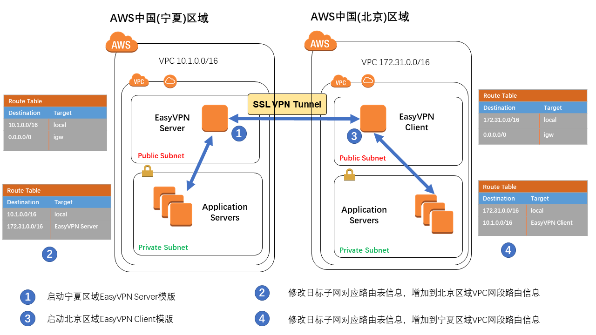
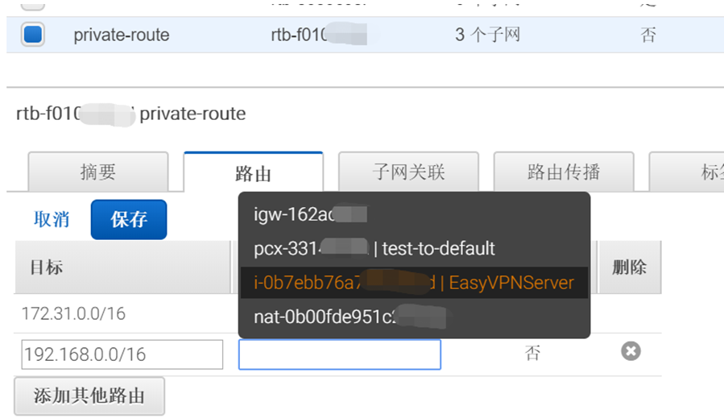
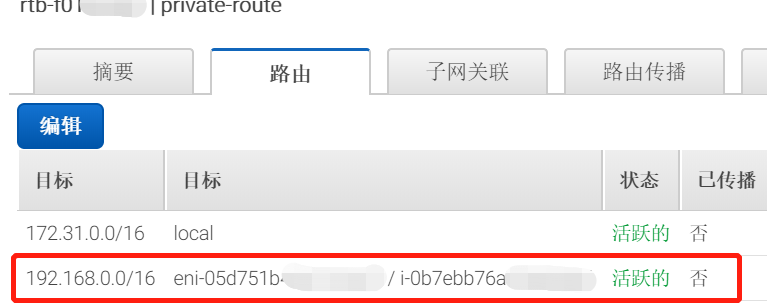
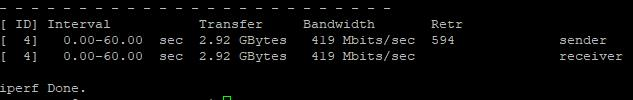

# Easy VPC Peering
*更新时间: 2019/01/20*
<br>
<br>
在AWS中国不同区域间快速建立VPC之间的互通

## 免责说明
建议测试过程中使用此方案，生产环境使用请自行考虑评估。<br>
当您对方案需要进一步的沟通和反馈后，可以联系 nwcd_labs@nwcdcloud.cn 获得更进一步的支持。<br>
欢迎联系参与方案共建和提交方案需求, 也欢迎在 github 项目issue中留言反馈bugs。

## 项目说明


当前AWS中国区域暂时还不支持跨区域VPC Peering, 如果AWS中国宁夏区域和北京区域VPC之间要互联的话，现在可以采用的方式:
1. 基于公网建立Lan-to-Lan VPN
2. 通过AWS Direct Connect 合作伙伴连接
<br>

本方案基于第1种方式，提供基于SSL VPN隧道技术(OpenVPN),快速在AWS中国两个区域之间，建立高可用的VPN通道。

## FAQ
- 问：什么时候用这个方案?<br>
在AWS中国不同区域, 两个网段不重叠的VPC之间，如果需要互联，并且没有计划使用专线方式链接。

- 问：如果AWS中国区域支持跨区域VPC Peering了，还需要这个方案吗? <br>
如果你需要对两个VPC之间的数据有审查或者更加细粒度的控制，例如：访问日志记录，防火墙细则，流量控制。你可能还是需要在两端的基于EC2搭建的VPN服务器上搭建相应的软件或者配置更加细致的规则。

## 操作步骤
 1. 启动宁夏区域EasyVPN Server模版
 
    AWS Region   | YAML Format 
    ------------ | ------------
    宁夏区域 | [](https://console.amazonaws.cn/cloudformation/home?region=cn-northwest-1#/stacks/new?stackName=EasyVPNServer&amp;templateURL=https://s3.cn-northwest-1.amazonaws.com.cn/nwcdlabs/templates/easy-vpc-peering/EasyVPN_Server.yaml)

    参数说明
    
    参数名称  | 参数含义  | 取值
    --------  | -------- | -----
    InstanceType | 实例类型 | 下拉选择：t2.micro(测试使用),c4.large(正式使用)
    KeyName | EC2登陆密钥对名称 | 下拉选择
    PeerVPNSubnets | 对端VPC网段 | 文本框: 可以是多个VPC网段，逗号分隔
    SSHLocation | Server实例允许SSH访问网段 | 文本框: 地址网段
    SubnetId | Server实例所在网段 | 下拉选择
    VpcId | Server实例所在VPC | 下拉选择

    输出说明

    参数名称  | 参数含义  | 取值
    --------  | -------- | -----
    PSK | VPN通道共享密钥 | Lambda函数自动生成512字节随机共享密钥
    InstanceId | VPN Server实例ID | 
    VPNServerIP | 对端VPN服务器IP地址 | 

 2. 修改目标子网对应路由表信息，增加到北京区域VPC网段路由信息
  - 选择目标路由表, 添加从EasyVPNServer到北京VPC路由
    
  - 确认路由设定<br>
    
    
 3. 启动北京区域EasyVPN Client模版
 
    AWS Region   | YAML Format 
    ------------ | ------------
    北京区域 | [](https://console.amazonaws.cn/cloudformation/home?region=cn-north-1#/stacks/new?stackName=EasyVPNClient&amp;templateURL=https://s3.cn-northwest-1.amazonaws.com.cn/nwcdlabs/templates/easy-vpc-peering/EasyVPN_Client.yaml)

    参数说明
    
    参数名称  | 参数含义  | 取值
    --------  | -------- | -----
    InstanceType | 实例类型 | 下拉选择：t2.micro(测试使用),c4.large(正式使用)
    KeyName | EC2登陆密钥对名称 | 下拉选择
    PeerVPNSubnets | 对端VPC网段 | 文本框: 可以是多个VPC网段，逗号分隔
    PSK | VPN通道共享密钥 | 文本框: 从EasyVPNServer模板输出的PSK获取
    SSHLocation | Server实例允许SSH访问网段 | 文本框: 地址网段
    SubnetId | VPN Client实例所在网段 | 下拉选择
    VpcId | VPN Client实例所在VPC | 下拉选择
    VPNServerIP | 对端VPN服务器IP地址 | 文本框: 从EasyVPNServer模板输出VPNServerIP获取

 4. 修改目标子网对应路由表信息，增加到宁夏区域VPC网段路由信息
 5. 测试连通性
    - 从Private Client端ping Private Server地址: 需要通过
    - 从Private Server端ping Private Client: 需要通过

## 性能测试
  - 测试环境

     设备  | 实例类型
    ------ | ------------
    EasyVPN Server | c4.large
    Private Server | c4.large
    EasyVPN Client | c4.large
    Private Client | c4.large
  - 测试方法
    - Private Server
    ```Bash
    #iperf3 -s
    ```
    - Private client
    ```Bash
    #iperf3 -t 60 -c 172.31.x.x
  - 测试结果<br>
    

## 高可用方案(TODO)
  - [HA计划](https://github.com/nwcdlabs/easy-vpc-peering/projects/3
  )
    - 阶段一: VPN Server/Client 增加Auto Recovery
    - 阶段二: 增加第二对VPN Server/Client, 启用keepalived监控并更新路由表 

## 成本(TODO)
  - [SPOT计划](https://github.com/nwcdlabs/easy-vpc-peering/projects/2)

## 参考
- [Multiple Region Multi-VPC Connectivity](https://aws.amazon.com/cn/answers/networking/aws-multiple-region-multi-vpc-connectivity/)
- [AWS Cloudformation Templates](https://github.com/awslabs/aws-cloudformation-templates)
- [Using the AWS Command Line Interface](https://docs.aws.amazon.com/AWSCloudFormation/latest/UserGuide/cfn-using-cli.html)
